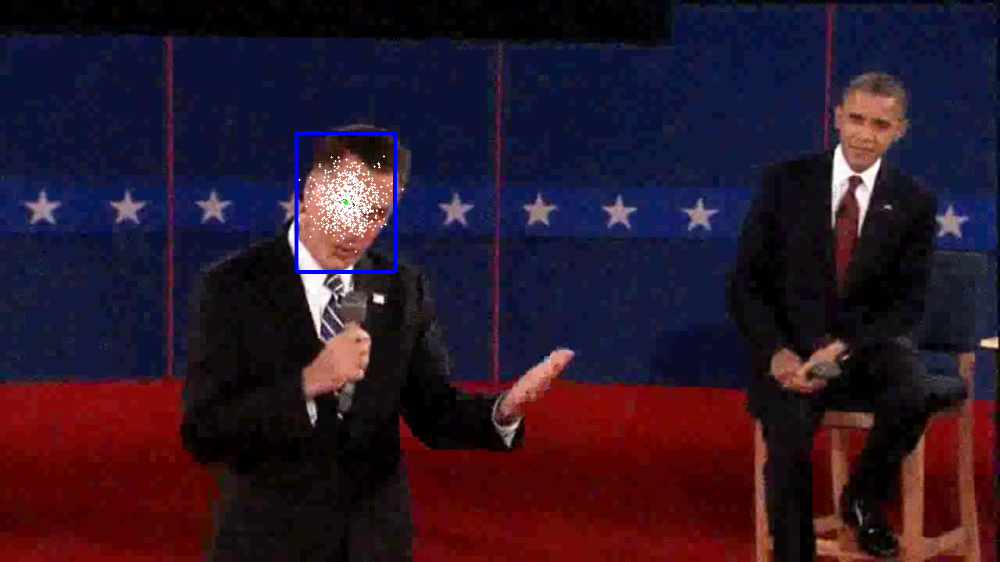
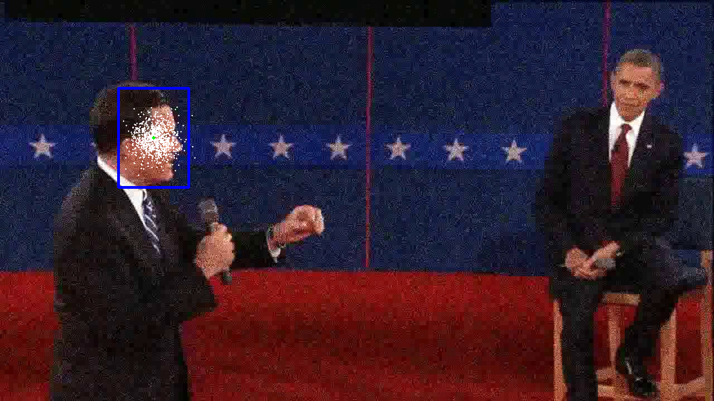
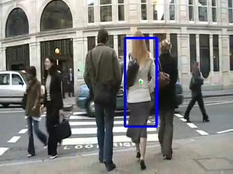
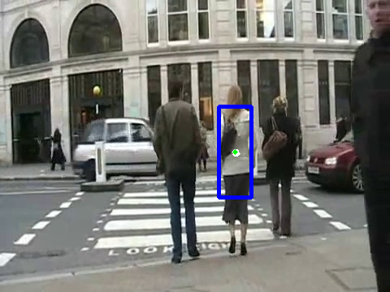
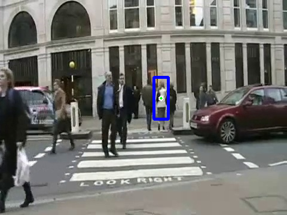
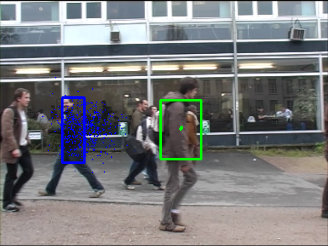
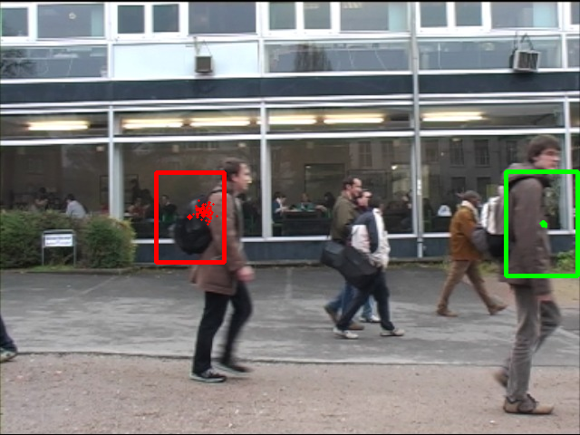

Object Tracking and Pedestrian Detection
========================================

## Synopsis

In this project I'm implementing object tracking methods for image sequences and videos. Two main algorithms used for tracking are the Kalman and Particle Filters.

Both methods use template detection for initialization of the tracked object and re-validation. 

In this project I'm tackling several common tracking problems with implementing various CV methods and improvements to Kalman/Particle filters, which include: 

1) Noise
2) Object change in appearance
3) Occlusions
4) Multiple targets for tracking
5) etc.

## Results

I've applied my algorithms to several video samples to check their performance.

### Presidential debates

One of the video samples include short clip from presidential debates, where I'm tracking Mitt Romney's head using particle filters. Video has artificially added noise to it which makes it a bit more difficult too. 

 

### Heavy pedestrian traffic

Another sample video is taken at heavy human traffic intersection, where I'm tracking a woman in grey suit. This sample has several difficult tracking problems at the same time: occlusions and change in appearance. Buit particles filter managed to accomplish its task with 5 stars. 

   

### Multiple targets

Final example shows application of above developed methods to tracking several chosen targets at the same time. 

 

## Code

 - experiment.py: contains execution script that runs multiple experiment with different methods
 - ps5.py: contains main methods for object tracking and image processing
 
